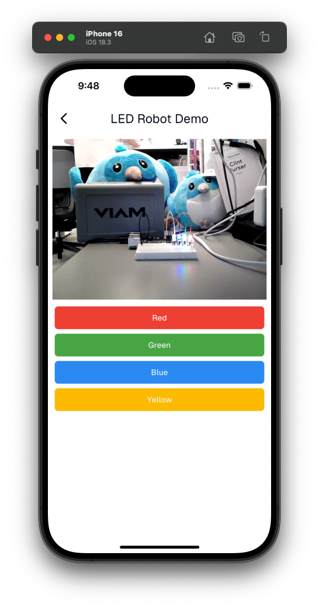

# Flutter & WebRTC Robotics demo

This is a sample app to show how to connect to and control a remote robot using WebRTC & Viam. 

In order to try this out on your own you must address the TODO in lib/consts.dart by inputting your robots host and API keys.

You can learn more about the hardware and pi setup [here](https://codelabs.viam.com/guide/led-blink/index.html?index=..%2F..index#0)

Learn more about Viam's Flutter SDK [here](https://pub.dev/packages/viam_sdk)

[Join Viam's Discord](https://discord.gg/viam)

[Link to slides](https://docs.google.com/presentation/d/1jcvjvlcWm0Lbsoy-E2s1EjzM74zHA_4mcr6qgIAFcCk/edit?usp=sharing)
